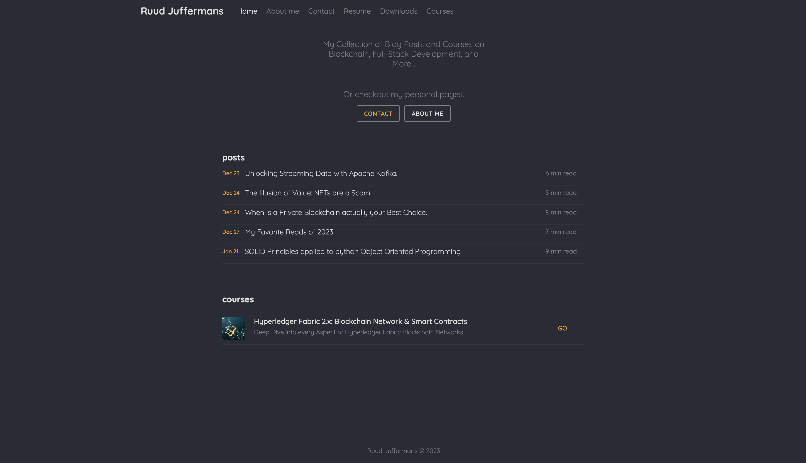

A simple SPA Portfolio built with React. Use it to showcase your blogposts, testimonials and other information.


## Preview


## How to use
1. Clone/Download the repo.
2. Run  ``` npm i ```.
3. Change the values in ```src/resumeData.js``` to suit your use-case.
4. Run ```npm run start``` to spin the up the local dev server port 3000.(http://localhost:3000).
